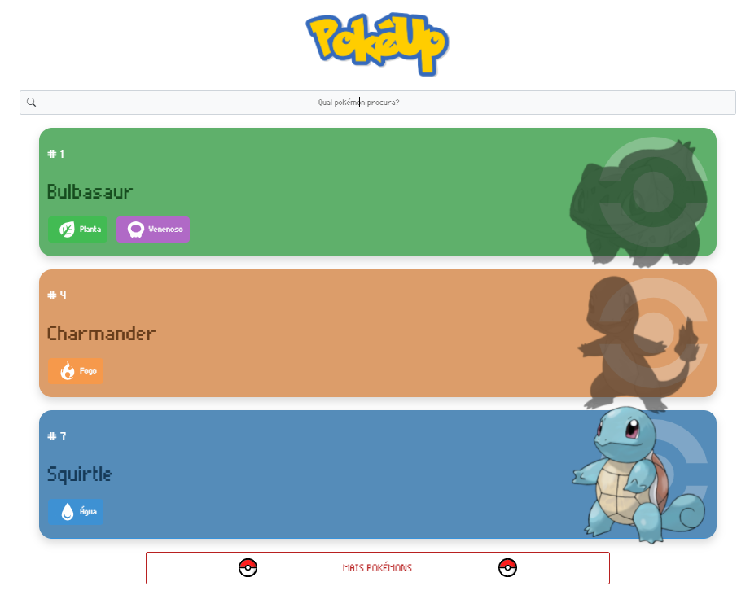

# PokeApiVanillaJS

<h1 align="left">
  
</h1>

## <a href="https://gorgeous-figolla-e64da4.netlify.app/">Clique aqui para acessar</a>
## 🔖 Features

- [✔] Carrega informações da API de 3 em 3;
- [✔] Muda o fundo de acordo com o tipo do pokemon;
- [✔] Tags de tipo de acordo com a quantidade e tipos de cada pokemon;
- [✔] Muda o fundo de acordo com o tipo do pokemon;
- [✔] Opacidade muda com hover;
- [✔] Filtro pelo nome do pokemon;
